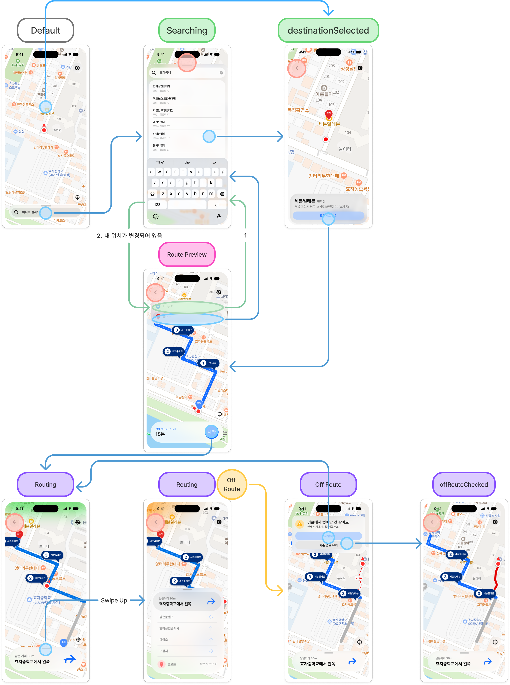

# ADR-001: ViewState enum 도입, Bool 기반 상태 관리 대체

## State
완료

## Date
2026-08-18

## Context
WalkingNavigationView의 화면 전환이 여러 Bool/Optional 프로퍼티의 조합으로 결정되고 있었다.
`isNavigating`, `route != nil`, `tappedCoordinate != nil`, `previewDestination != nil` 등을 if-else 체인으로 분기하다 보니:
- 어떤 상태에서 어떤 UI가 보이는지 한눈에 파악이 어려움
- 상태 조합이 늘어날수록 분기가 복잡해짐
- 잘못된 상태 조합(예: navigating인데 route가 nil)이 컴파일 타임에 잡히지 않음

<br>


주요 화면 플로우

## Decision
`ViewState` enum을 도입하여 화면 상태를 명시적으로 관리:

```swift
enum ViewState {
    case main          // 기본 화면
    case routePreview  // 경로 미리보기
    case loading       // API 응답 대기
    case navigating    // 내비게이션 중
    case error(Error)  // 에러
}
```

View에서 `switch viewModel.viewState`로 분기하여 각 상태별 UI를 명확히 분리.

## Result
- if-else 체인 → switch 문으로 전환, 각 case별 UI 구성이 명확해짐
- `searching` case는 `main` case의 orthogonal한 상태이기 때문에 삭제했음. `.searching` 은 추후에 다른 ViewState에서도 사용가능할 수 있기 때문에 하나로 분리하는 것 보다 개별 View, ViewModel로 분리하는 것이 좋다고 판단.
- `RouteDeviationState`에 `offRouteChecked` case 추가 (경로 이탈 확인 상태)
- 미사용 `CustomTopToolbar` 삭제, 뷰 이름 정리도 함께 진행