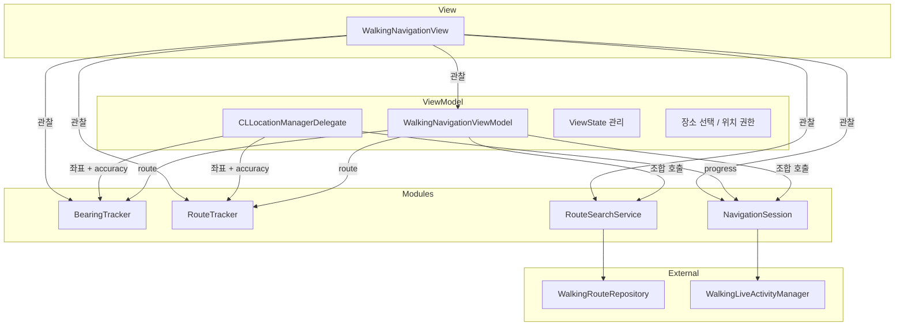

# ADR-002: ViewModel의 책임 분리

## Status
완료

## Date
2026-08-21

## Context
ViewModel에 너무 많은 책임이 있다.

```swift

// MARK: - 장소 선택

func placeSelected(_ place: Place)

func clearSelectedPlace() // ViewModel 외부에서 selectedPlace = nil로 바꿈

func mainMode() // main mode로 바꾸는 데에 필요한 행동들

func setStartFromCurrentLocation() // 시작 위치를 현재 위치로 설정

// MARK: - 경로 탐색

func searchRoute()

func dismissRoute()
// 프로퍼티 초기화
// navigating이면 stopNavigation() 호출

// MARK: - 내비게이션

func startNavigating()

func stopNavigation()

func refreshLiveActivity() // Setting에서 사용 : 설정 값이 바뀌었을 때 사용

// MARK: - 경로 이탈

// Off-Route 상태에서 더 이상 경고를 주지 않아도 된다고 설정했을 때
func keepCurrentRoute()

func rerouteFromCurrentLocation()
// GPS 업데이트마다 호출되어 "경로 이탈 여부"를 판정하는 상태 머신
private func updateDeviationState(at current: Coordinate, routeMatch: RouteMatch, horizontalAccuracy: CLLocationAccuracy)

// navigating 상태에서 이탈이 아님을 감지하였을 때 호출
private func resetDeviationState()

// 이탈했을 때, 지나온 좌표를 추가해줌
private func appendDeviationCoordinate(_ coordinate: Coordinate)

// MARK: - 경로 진행 계산

private func initialProgress(_ route: WalkingRoute) -> WalkingProgress

private func calculateProgress(at current: Coordinate, route: WalkingRoute) -> WalkingProgress

private static func passedZoneCenter(for maneuver: WalkingManeuver, routePath: [Coordinate]) -> Coordinate?

// MARK: - 경로 매칭

private struct RouteMatch {
    let segmentIndex: Int
    let distance: CLLocationDistance
    let snappedCoordinate: Coordinate
}

// 현재 위치에서 가장 가까운 route element를 찾는다.
private func matchToRoute(current: Coordinate, routePath: [Coordinate]) -> RouteMatch?

// 사용자의 현재 위치가 경로에서 얼마나 떨어져 있는가
private func routeMatch(current: Coordinate, segmentStart: Coordinate, segmentEnd: Coordinate, segmentIndex: Int) -> RouteMatch

// MARK: - 카메라 방향

// 사용자의 진행 방향 = 화면 위쪽이 유지되도록 하는 카메라 회전 로직
private func updateNavigationBearing(at current: Coordinate, route: WalkingRoute)

// 경로 시작점에서 20m 앞까지의 방향 계산 (초기값용)
private func updateNavigationBearingFromRouteStart(_ route: WalkingRoute)

// 두 좌표 간 지리적 방위각 계산 (Haversine 공식)
private func bearing(from start: Coordinate, to end: Coordinate) -> CLLocationDirection

// 방위각 변화를 보간(0.35 비율)해서 카메라가 급격히 회전하지 않게 함
private func smoothedBearing(from previous: CLLocationDirection?, to candidate: CLLocationDirection) -> CLLocationDirection

// MARK: - 위치 권한

func startLocationTracking()

func requestLocationAccess()

// MARK: - CLLocationManagerDelegate

func locationManager(_ manager: CLLocationManager, didUpdateLocations locations: [CLLocation])

func locationManager(_ manager: CLLocationManager, didFailWithError error: Error)

func locationManagerDidChangeAuthorization(_ manager: CLLocationManager)

func locationManager(_ manager: CLLocationManager, didUpdateHeading newHeading: CLHeading)
```

## Decision

### Data Model을 체택한다

1. Data Model을 체택하여 비슷한 함수들을 모듈 단위로 분리한다.
2. ViewModel은 상태를 감지하고 각 상태에 따라 어떤 모듈을 호출하고 삭제할지 결정한다.
3. 모듈을 조합하고 반환값에 따라 어떤 상태로 바꿀지 결정한다.

### 분리

#### 모듈이 아닌 것

1. `CLLocationManagerDelegate`
    위치 업데이트 함수는 최신 위치 정보를 필요로하는 모듈에 위치를 업데이트 시켜준다.
2. 위치 권한
3. 상태 (ViewState) 선택 함수

#### 모듈로 분리할 것

1. 카메라 방향 설정 모듈
2. 경로 매칭 모듈 (사용자가 현재 경로에서 어디에 있으며 잘 진행중인지 검사, 경로를 지나면 회색으로 표시)
3. 경로 탐색 및 삭제
4. 네비게이션

### ViewModel의 역할

- Module 들을 조합 하고 상태에 따라 호출하고 삭제
- ViewState 업데이트

### 모듈 의존성



## Result

### 추가된 파일 (`Domain/Modules/`)

| 모듈 | 파일 | 역할 |
|------|------|------|
| `BearingTracker` | `BearingTracker.swift` | 카메라 방향 계산 (Haversine, 20m lookahead, 0.35 smoothing) |
| `RouteTracker` | `RouteTracker.swift` | 경로 매칭 + 이탈 판정 + 진행도 계산 |
| `RouteSearchService` | `RouteSearchService.swift` | route 소유 + repository 호출 |
| `NavigationSession` | `NavigationSession.swift` | Live Activity 래핑 + 도착 상태 |

모든 모듈은 `@Observable class`로, View에서 중첩 관찰 가능.

### 변경된 파일

- **WalkingNavigationViewModel.swift**: 654줄 → ~290줄. 모듈 조합 + ViewState 관리 + CLLocationManagerDelegate만 남음
- **WalkingNavigationView.swift**: 프로퍼티 접근 경로가 모듈 경유로 변경 (`viewModel.routeTracker.progress` 등)

### 함께 수정된 버그

- `searchRoute()`의 `defer { viewState = .main }` 제거 — `.routePreview`를 덮어쓰는 문제
- `destination!.name` force unwrap → optional chaining
- `searchRoute()` 호출 시 `selecedPlace`를 `destination`으로 설정하는 로직 추가

### 향후 주의할 점

- View에서 모듈 프로퍼티에 접근할 때 `viewModel.모듈.프로퍼티` 경로를 사용해야 함
- `rerouteFromCurrentLocation`은 3개 모듈을 조합하는 오케스트레이션이므로 ViewModel에 남겨둠
- `RouteTracker`의 `DeviationState`는 기존 `RouteDeviationState`를 대체하므로, 외부에서 참조 시 `RouteTracker.DeviationState`로 접근
